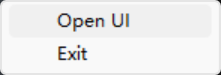
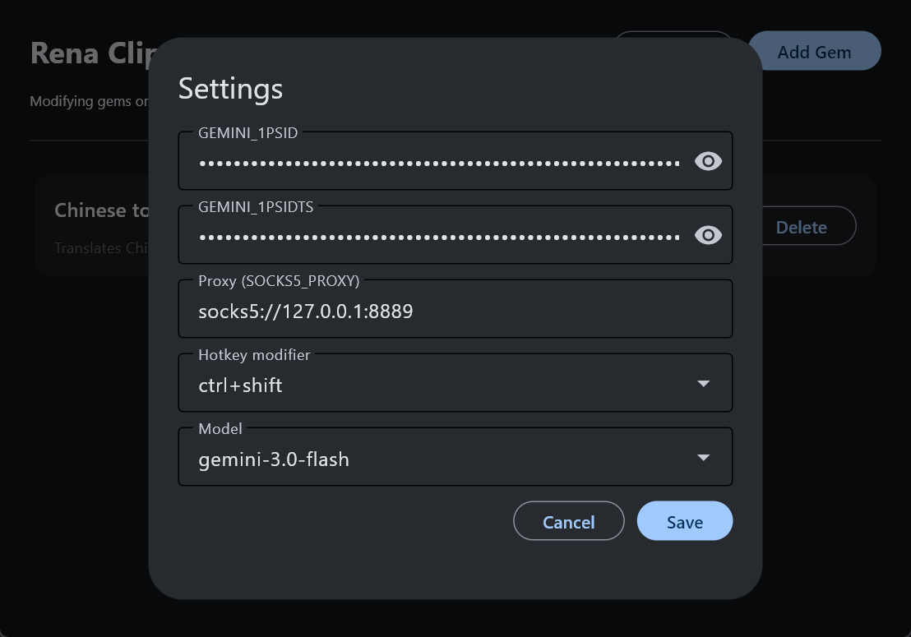

# RenaClip

**R**eal-time **E**nhanced **N**eural **A**ssistant for **Clip**board — use Gemini-powered “gems” to process clipboard text with global hotkeys.


---

## Overview

RenaClip runs a clipboard service in the system tray. You define **gems** (each with a name, description, and system prompt). When you press a hotkey (e.g. **Ctrl+1**, **Ctrl+2**), the current clipboard content is sent to the corresponding gem; the model’s reply is written back to the clipboard and a notification is shown.

- **UI**: Manage gems and settings via a desktop app (Flet).
- **Tray**: Service runs in the background; left-click the tray icon to open the UI, or use the menu to exit.

---

## Requirements

- Python 3.10+
- Dependencies in `requirements-gemini-demo.txt` (Gemini API, clipboard, hotkeys, tray, etc.)

```bash
pip install -r requirements-gemini-demo.txt
```

You also need valid Gemini cookies (e.g. `__Secure-1PSID`, `__Secure-1PSIDTS`) configured in **Settings** (see below).

---

## Running

1. **Start the clipboard service (with tray)**  
   From the project directory:
   ```bash
   python renaclip_app.py
   ```
   Optional: `python renaclip_app.py --gem "Gem name" --gem "Another"` to use specific gems.

   

2. **Open the UI**  
   Left-click the RenaClip tray icon, or choose **Open UI** from the tray menu.  
   If the UI is already open, another window is not started.

   

3. **Use hotkeys**  
   Copy text, then press the modifier + number for a gem (e.g. **Ctrl+1** for the first gem). The result replaces the clipboard content.

4. **Exit**  
   Right-click the tray icon → **Exit**.

---

## Screenshots

### 1. Main interface

Gems list, **Settings**, and **Add Gem**. Each gem can be edited or deleted.


### 2. Edit / Add Gem

Set the gem **name**, **description**, and **prompt** (system instruction). Used when creating a new gem or editing an existing one.


### 3. Settings

Configure Gemini cookies (`GEMINI_1PSID`, `GEMINI_1PSIDTS`), optional **SOCKS5 proxy**, **hotkey modifier** (e.g. ctrl, ctrl+shift), and **model**.  
After changing settings, restart the program for them to take effect.



---

## Configuration

- **Gems and settings** are stored in `gem_config.json` (created on first save).
- **Modifying gems or settings requires restarting the program** (restart the tray service / UI as needed).

---

## License

See repository for license information.
