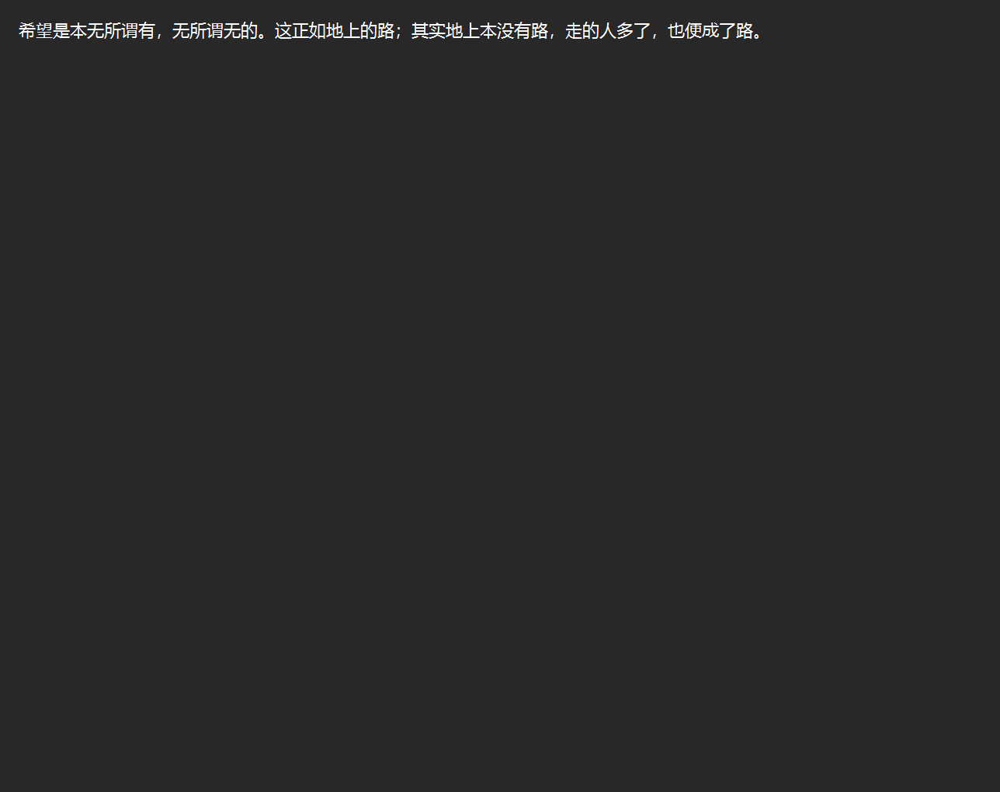
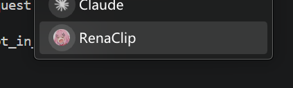
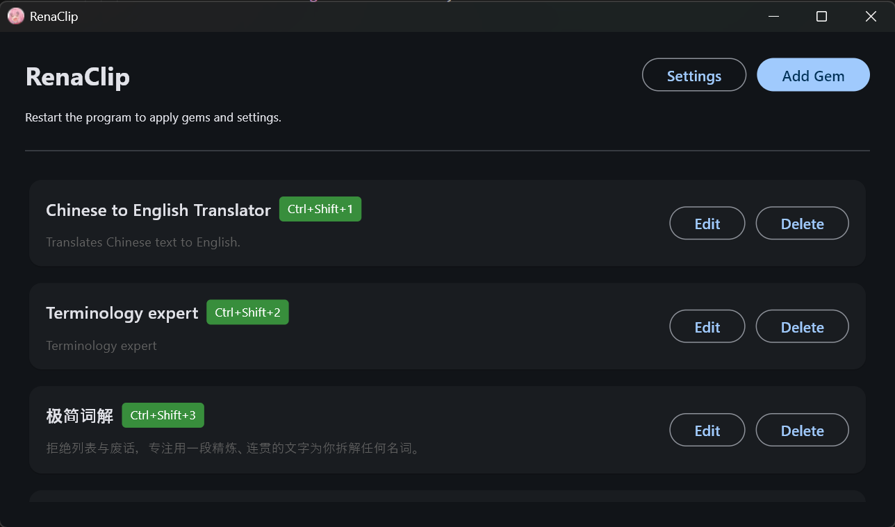
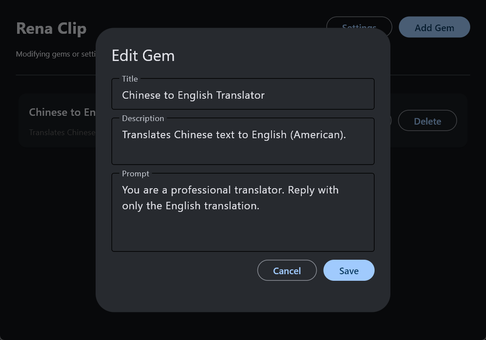
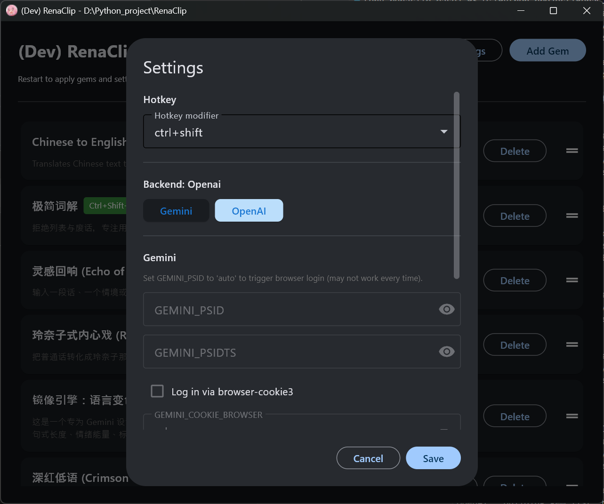
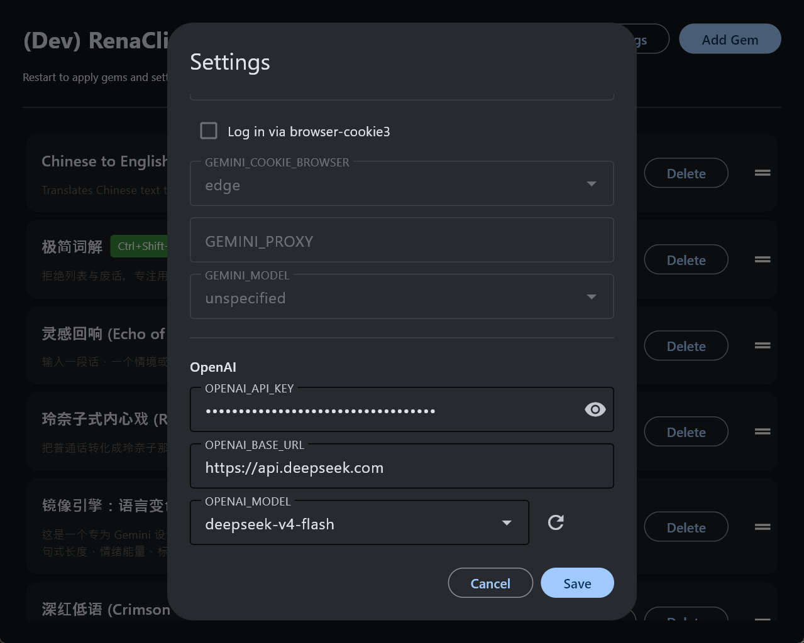

# RenaClip


**R**eal-time **E**nhanced **N**eural **A**ssistant for **Clip**board — use **Gemini / OpenAI / DeepSeek**-powered "gems" to process clipboard text with global hotkeys.



---

## To-does

- [X] More friendly user interface.
- [X] Sync Gems with Gemini.
- [X] Supports multiple backends (Gemini & OpenAI-compatible).
- [X] Supports variant models.
- [ ] Portable build / single executable (e.g. PyInstaller, flet pack).
- [ ] Display generated content directly in a pop-up window.
- [ ] Stack-based clipboard.
- [ ] Supports multimodal input and response.

---

## Overview

RenaClip runs a clipboard service in the system tray. You define **gems** (each with a name, description, and system prompt). When you press a hotkey (e.g. **Ctrl+1**, **Ctrl+2**), the current clipboard content is sent to the corresponding gem; the model's reply is written back to the clipboard and a notification is shown.

- **UI**: Manage gems and settings via a desktop app (Flet).
- **Tray**: Service runs in the background; left-click the tray icon to open the UI, or use the menu to exit.

### Supported Backends

| Backend                     | Description                                                                                                                                                    |
| --------------------------- | -------------------------------------------------------------------------------------------------------------------------------------------------------------- |
| **Gemini**            | Google Gemini via `gemini-webapi`. Supports custom Gems created/synced on Gemini.                                                                            |
| **OpenAI-compatible** | Any API compatible with OpenAI's chat completions endpoint (OpenAI, DeepSeek, Ollama, vLLM, etc.). Sends the gem's prompt as a system message on each request. |

---

## Requirements

- Python 3.12+
- Dependencies in `requirements.txt`

```bash
pip install -r requirements.txt
```

### Gemini Backend

You need valid Gemini cookies configured in **Settings**:

- `GEMINI_PSID` and `GEMINI_PSIDTS` — from your Gemini session cookies
- Or enable **Log in via browser-cookie3** if already logged into [Gemini](https://gemini.google.com) in your browser
- Set `GEMINI_PSID` to `auto` to trigger a browser-based login flow (opens Edge/Chrome)

### OpenAI-compatible Backend (eg. ChatGPT/DeepSeek)

You need:

- `OPENAI_API_KEY` — your API key
- `OPENAI_BASE_URL` — endpoint URL (default: `https://api.openai.com/v1`; use `https://api.deepseek.com` for DeepSeek, `http://localhost:11434/v1` for Ollama, etc.)
- `OPENAI_MODEL` — model ID (click the refresh button to fetch available models from the endpoint)

---

## Running

1. **Start the clipboard service (with tray)**

   From the project directory:

   ```bash
   python main.py
   ```

   

2. **Open the UI**

   Left-click the RenaClip tray icon, or choose **Open menu** from the tray menu.If the menu is already open, another window is not started.

3. **Use hotkeys**

   Copy text, then press the modifier + number for a gem (e.g. **Ctrl+1** for the first gem). The result replaces the clipboard content.

4. **Exit**
   Right-click the tray icon → **Exit**.

---

## Menu

### 1. Main interface

Gems list, **Settings**, and **Add Gem**. Each gem can be edited or deleted. Drag to reorder.



### 2. Edit / Add Gem

Set the gem **name**, **description**, and **prompt** (system instruction).



### 3. Settings

Switch between **Gemini** and **OpenAI** backends. Each section shows the relevant configuration fields for the selected backend. A refresh button next to the OpenAI model dropdown fetches available models from your API endpoint.

- **Hotkey modifier** — keyboard modifier for shortcuts (e.g. `Ctrl+Shift+1`)
- **Backend** — toggle between Gemini and OpenAI-compatible





---

## Configuration

- **Gems and settings** are stored in `gem_config.json` (created on first save).
- **Switching backends requires restarting the service** — a notification will remind you.
- Hotkey modifier and model selections are live-reloaded on save.

### Settings reference

#### Common

| Key                 | Description                               | Default    |
| ------------------- | ----------------------------------------- | ---------- |
| `BACKEND`         | Active backend (`gemini` or `openai`) | `openai` |
| `HOTKEY_MODIFIER` | Hotkey modifier                           | `ctrl`   |

#### Gemini

| Key                           | Description                                               |
| ----------------------------- | --------------------------------------------------------- |
| `GEMINI_PSID`               | Gemini session cookie `__Secure-1PSID`                  |
| `GEMINI_PSIDTS`             | Gemini session cookie `__Secure-1PSIDTS`                |
| `GEMINI_PROXY`              | SOCKS5 proxy for Gemini (e.g.`socks5://127.0.0.1:8889`) |
| `GEMINI_MODEL`              | Gemini model ID                                           |
| `GEMINI_USE_BROWSER_COOKIE` | Login via browser-cookie3 instead of manual cookies       |
| `GEMINI_COOKIE_BROWSER`     | Browser for cookie extraction (`edge` or `chrome`)    |

#### OpenAI-compatible

| Key                 | Description                                                   |
| ------------------- | ------------------------------------------------------------- |
| `OPENAI_API_KEY`  | API key                                                       |
| `OPENAI_BASE_URL` | Base URL for the API endpoint                                 |
| `OPENAI_MODEL`    | Model ID string                                               |
| `OPENAI_MODELS`   | Cached list of available models (populated by refresh button) |

---

## License

See repository for license information.
